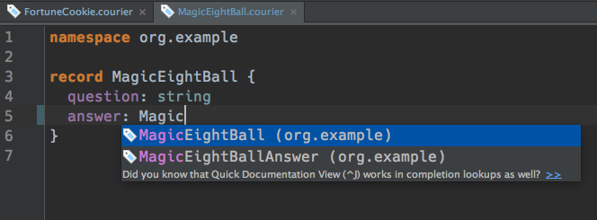
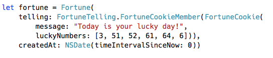
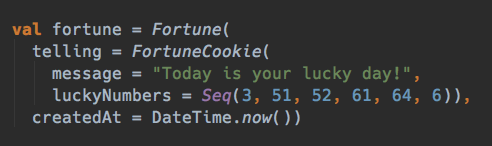

<code><pre>
namespace org.example

import org.example.common.DateTime

/**
 * A fortune.
 */
record Fortune {
  message: String
  createdAt: DateTime
}
</pre></code>

<code><pre>
{
  "message": "Today's your lucky day!",
  "createdAt": "2016-02-08T16:22:33Z"
}
</pre></code>

How development with Courier works
----------------------------------

* Developers write `.courier` (or `.pdsc`) schema files.
* Data bindings are generated from schemas for each language using the provided build system plugins.
* Developers then code against those data bindings and get a strong guarantee that the JSON (or binary protocol) that those bindings read and write are compatible with all the other languages doing the same thing.

Feature status
--------------

Schema language:

* Courier schema language (`.courier` file format).
* Fully compatible with [.pdsc](https://github.com/linkedin/rest.li/wiki/DATA-Data-Schema-and-Templates)
* Also fully Compatible with [Avro](http://avro.apache.org/) schemas

Supported Languages:

* Scala
* [Swift](https://github.com/coursera/courier/tree/master/swift)
* [Android Java](https://github.com/coursera/courier/tree/master/android)
* Java (via [Pegasus](https://github.com/linkedin/rest.li/wiki/DATA-Data-Schema-and-Templates))
* Javascript (via JSON)

Supported Build Systems:

* [SBT Plugin](https://github.com/coursera/courier#getting-started)
* [Gradle Plugin](https://github.com/coursera/courier/tree/master/gradle-plugin)

Supported Protocols:

* JSON
* Avro Binary
* PSON (JSON Equivalent binary format)
* BSON (Another JSON Equivalent binary format)

IDE Support:

* [Courier IntelliJ IDEA Plugin](https://plugins.jetbrains.com/plugin/8005?pr=idea)

Overview
--------

  <ul>
    <li>Scala</li>
    <li><a href="https://github.com/coursera/courier/tree/master/swift">Swift</a></li>
    <li><a href="https://github.com/coursera/courier/tree/master/android">Android Java</a></li>
    <li>Java (via <a href="https://github.com/linkedin/rest.li/wiki/DATA-Data-Schema-and-Templates">Pegasus</a>)</li>
    <li>Javascript (via JSON)</li>
  </ul>

**Modern Schema language**

Courier is a concise but comprehensive schema language, based on
Pegasus and Avro, and with language features from Scala, Swift, and Avro IDL.

**Idiomatic Data bindings**

Courier goes to great lengths to produce data bindings that look and feel natural to developers.

For example, for Scala, Courier generates immutable Scala case classes, `Option`, default parameters, pattern matching, sealed traits, Scala collections and Scala enumerations to produce ADT style bindings that look and behave how Scala developers expect.

  <b>Swift</b>
   
  

  <b>Scala</b>
   
  

 

**Language interoperability**

Courier builds on the language interoperability features of Pegasus:

* Languages share a common understanding of the structure of the data they read and write.
* Language binding generators eliminate the tedious and error prone process of manually writing serializers.
* Consistent data modeling is promoted, often resulting in JSON data that is easier to understand and work with.

**Multiple data protocols**

The data bindings generated by Courier work with all the Codecs that have been built for Pegasus. Since Pegasus includes Codecs for JSON as well as multiple "JSON equivalent" binary protocols, developers can easily switch between protocols as needed, or even write their own.

This means developers can easily use different data protocols for different needs. For example, with Courier it is trivial to:

* Provide simple RESTful JSON APIs to mobile and web developers
* Persist data using compact binary protocol such as Avro
* Message data efficiently between backend services in a "JSON equivalent" binary protocol such as PSON
